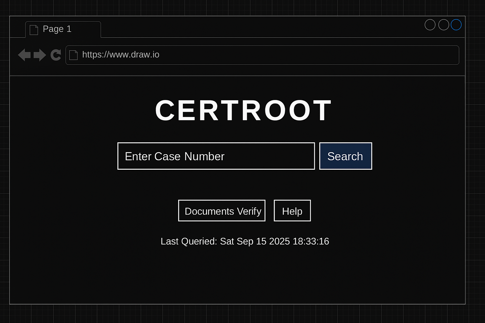
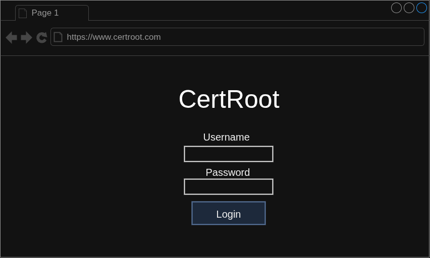

### **Updated Project Proposal: CertRoot - A Decentralized Audit and Archive Log for ClearRisk**

#### 1. Introduction & Problem Statement

In the modern enterprise, maintaining the integrity of data and processes is paramount. Traditional, centralized audit logs and databases, while efficient, suffer from a fundamental flaw: they are susceptible to internal tampering, data breaches, and a lack of verifiable trust. This creates a single point of failure that can compromise an organization’s ability to defend against fraud and prove regulatory compliance.

This project, **CertRoot**, proposes a novel solution that bridges this security gap by acting as a decentralized, immutable audit and archive log. By leveraging a truly decentralized architecture on an EVM-compatible blockchain, CertRoot will create a secure and tamper-proof record of critical business actions, providing an unparalleled level of trust and verifiability for enterprise clients like those of ClearRisk.

---

#### 2. Unique Value Proposition & Proposed Improvements

CertRoot's primary goal is to provide a robust, backend security layer that enhances the integrity of existing enterprise software solutions. The integration with ClearRisk will transform their claims management process from a centralized trust model to a decentralized, cryptographic one.

- **Enhanced Data Integrity:** ClearRisk’s current reporting and data are reliable, but their integrity is dependent on the integrity of the centralized system. CertRoot provides a cryptographic "fingerprint" of every major action within a claim's lifecycle, which is permanently logged on an immutable public blockchain. This creates an unchangeable, verifiable record of actions that can be independently audited, eliminating the risk of data being altered after the fact.
- **Seamless B2B Integration:** The system is designed to integrate seamlessly with a client's existing platform (ClearRisk) via a simple API. There is no need for the end-user to change their workflow, ensuring a practical and efficient solution for both the software provider and their clients.
- **Advanced Data Privacy:** The system minimizes data stored on the public blockchain. This is achieved by taking a cryptographic hash of the case and customer IDs, and then recording only this hash on-chain. This ensures that no personally identifiable information or simple, predictable identifiers are ever made public, protecting sensitive client information while maintaining provable authenticity.
- **Independent Verification Portal:** While the integration is seamless for day-to-day users, a separate, dedicated web portal will be built for auditors and administrators to independently query and verify records directly from the blockchain.

---

#### 3. Technical Architecture

The application will be built using a robust and widely-adopted technology stack to ensure feasibility and scalability.

- **Backend & Smart Contracts:**
  - **EVM-Compatible Blockchain:** The project will be deployed on a cost-effective, high-throughput EVM-compatible blockchain (e.g., Polygon, Arbitrum) to minimize transaction costs and ensure rapid confirmation times.
  - **Solidity:** The core logic for recording business events will be written in **Solidity**, the industry-standard language for EVM smart contracts.
  - **Hardhat:** The project will utilize **Hardhat** for local development, testing, and deployment of smart contracts, allowing for a robust and secure development environment.
- **API Integration:** The core business application (ClearRisk) will communicate with the smart contract via a REST API to submit hashes of business events.
- **Auditor Frontend:** The separate web portal will be built using **React.js** to allow auditors to query the blockchain and verify data.
- **Communication:**
  - **Web3.js or Ethers.js:** Both the backend API and the auditor frontend will communicate with the smart contracts using a JavaScript library like **Ethers.js** to handle on-chain transactions and data queries.

---

#### 4. CertRoot API Endpoints

This section describes the primary API endpoints that CertRoot will provide to ClearRisk for integrating with its system and the blockchain.

- **Case Management**
  - `POST /cases` – Create and register a new case on the blockchain.
  - `GET /cases/{caseId}` – Retrieve a case summary and its current state.
  - `GET /cases/{caseId}/events` – Get a chronological list of all recorded events for a specific case.
  - `POST /cases/{caseId}/events` – Append a new event to a case, which is then recorded and cryptographically hashed on-chain.
- **Event & Document Handling**
  - `POST /documents/upload` – Upload a document, and the backend will compute and return its cryptographic hash.
  - `POST /documents/hash` – Manually submit a hash for verification.
  - `GET /documents/{hash}/verify` – Check if a given hash exists on the blockchain and return its verification status (Verified / Not Found).
- **Blockchain Verification**
  - `GET /blockchain/transactions/{txId}` – Retrieve detailed blockchain transaction information, such as gas costs and block height.
  - `GET /cases/{caseId}/blockchain-links` – Return a list of direct links to a blockchain explorer for each recorded event, allowing for independent verification.
- **User & Auditor Management**
  - `POST /users/register` – Register a new auditor or system user.
  - `POST /users/login` – Authenticate a user to generate a JWT or session token.
  - `GET /users/{userId}/cases` – List all cases associated with a specific user.
- **Admin & Utilities**
  - `GET /health` – A health check endpoint for monitoring system status.
  * `GET /config` – Return system configuration details, including network information and blockchain explorer URLs.
  * `POST /audit/logs` – Write an audit log for operations that do not involve the blockchain.

---

#### 5. Wireframes for Auditor UI

This section outlines the planned design and functionality of the dedicated web portal for auditors and administrators, with a direct mapping to the API endpoints.

- **1. Case Search Page:** A simple interface with a search bar. The auditor can enter a case ID to navigate to its details.
  - **Mapped Endpoints:** `GET /cases/{caseId}` and `GET /cases/{caseId}/events`.
  - 
- **2. Case Details Page:** A dashboard that displays a chronological list of all recorded events for a case, including the timestamp and cryptographic hash.
  - **Mapped Endpoints:** `GET /cases/{caseId}/events` and `GET /cases/{caseId}/blockchain-links`.
  - 
- **3. Hash Verification Tool:** A tool that allows auditors to upload a document or paste a hash to verify its existence on-chain.
  - **Mapped Endpoints:** `POST /documents/upload`, `POST /documents/hash`, and `GET /documents/{hash}/verify`.
  - 
- **4. Blockchain Link Page:** Provides direct links to the public blockchain explorer for each recorded event, allowing for external and independent verification.
  - **Mapped Endpoints:** `GET /cases/{caseId}/blockchain-links` and `GET /blockchain/transactions/{txId}`.
  - 
- **5. User / Auditor Login & Dashboard:** The login page for auditors and a dashboard to view the cases assigned to them.
  - **Mapped Endpoints:** `POST /users/login` and `GET /users/{userId}/cases`.
  - 
  - 
- **6. Admin & Monitoring:** Backend utility pages to ensure system health and manage network configurations.
  - **Mapped Endpoints:** `GET /health`, `GET /config`, and `POST /audit/logs`.
  - 

---

#### 6. Comparison: With and Without CertRoot Integration

##### **Current Solution: ClearRisk Only**

The current ClearRisk solution provides significant improvements in efficiency and reporting by centralizing data in a cloud-based system. Its auditing capability relies on granting an auditor a license to access the ClearRisk system remotely.

- **Auditability:** Audits are performed by providing the auditor with direct access to the centralized ClearRisk system. This is a vast improvement over manual, paper-based audits, saving travel time and costs.
- **Data Reliability:** The reliability and accuracy of the reports and data are dependent on the integrity of the data stored within the ClearRisk system itself. The trust in the data and the workflow is internal to the ClearRisk platform.
- **Internal Fraud:** Detecting internal fraud requires a manual audit trail review, relying on the integrity of the internal log. Any malicious actor with sufficient administrative access could potentially alter or delete records without an external, verifiable log.

##### **Post-Integration: ClearRisk + CertRoot**

Integrating CertRoot introduces a new, independent, and verifiable layer of trust to the ClearRisk workflow. This shifts the audit process from simply trusting the data in the ClearRisk system to being able to cryptographically verify its integrity on an immutable public blockchain.

- **Immutable Workflow Audit Trail:** CertRoot logs a cryptographic "fingerprint" (hash) for every valid action or stage in a case's lifecycle within ClearRisk. This creates a **tamper-proof, permanent record** of the entire process, from initial claim submission to resolution.
- **Trustless Verification:** The auditor no longer needs to rely solely on access to the ClearRisk system. They can use the independent CertRoot portal to query the blockchain and **verify the sequence and integrity of actions** for any case ID. This provides external, cryptographic proof that the data and workflow have not been altered.
- **Enhanced Security & Fraud Prevention:** While ClearRisk centralizes data for easy access, CertRoot's integration ensures that a cryptographic record of the workflow exists outside of the centralized system. This provides a security backup and a mechanism to **instantly detect any internal tampering** with the records, as the on-chain hash would not match the altered data.

---

#### 7. Agile Milestones & Timeline

The project will follow an Agile methodology with a series of 2-week sprints, allowing for continuous delivery and adaptation. The entire project timeline will run until the last week of November.

- **Sprint 1 (Weeks 1-2): Foundational Development**
  - Define project backlog and user stories.
  - Set up the development environment (Hardhat, etc.).
  - Develop the core smart contract for recording business events.
  - Write unit tests for the smart contract's key functions.
- **Sprint 2 (Weeks 3-4): Backend API & Auditor Frontend**
  - Finalize smart contract development and testing.
  - Deploy the smart contract to a local blockchain test environment.
  - Begin building the simple API to interface with the smart contract.
  - Begin building the auditor frontend to query the blockchain.
- **Sprint 3 (Weeks 5-6): Integration & End-to-End Testing**
  - Integrate the API with a mock frontend to simulate a client's system.
  - Deploy the smart contract to an EVM Layer 2 test network (e.g., Polygon).
  - Test all end-to-end user flows, including the audit verification process.
- **Sprint 4 (Weeks 7-8): Refinement & Optimization**
  - Perform final bug fixing and code refactoring.
  - Optimize the mock UI/UX.
  - Prepare a final, fully functional version of the application for demonstration.
- **Final Week (Week 9): Documentation & Presentation**
  - Write the final project report and create detailed code documentation.
  - Prepare and rehearse the final project presentation.

---

#### 8. Conclusion

CertRoot is not just a document verification tool; it is a proof-of-concept for a new standard of trust in the enterprise. By building a truly decentralized backend system that is secure and seamlessly integrated, this project will not only solve a critical real-world problem but also serve as a powerful portfolio piece demonstrating a deep understanding of modern Web3 technologies and their application in the B2B space. The app’s architecture will provide a resilient, permanent, and verifiable solution that elevates existing software platforms.
